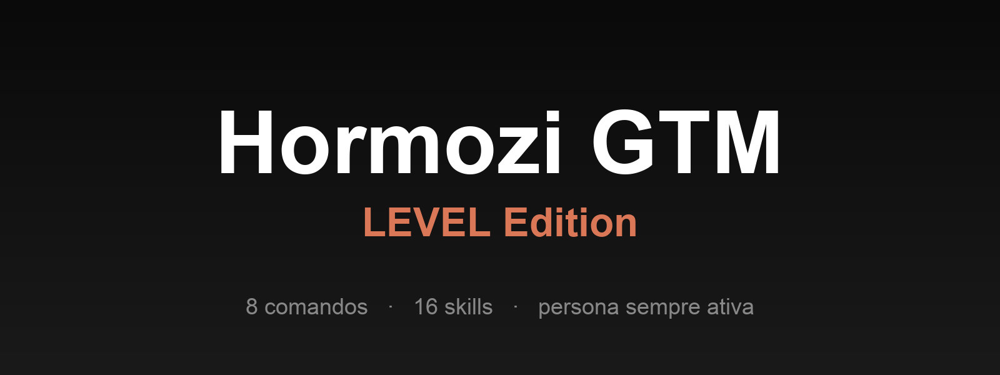

<div align="center">

<a href="https://github.com/henriquecaner/hormozi-gtm">
  
</a>

# Hormozi GTM — LEVEL Edition

**Operação GTM no estilo Alex Hormozi para o time e clientes da LEVEL.**

Plugin Claude Code com 8 comandos, 16 skills e contrato `gtm-context.md` que
persiste entre sessões. Persona Alex Hormozi sempre ativa. Humanizer obrigatório
em copy externa.

[](./LICENSE)
[](https://github.com/henriquecaner/hormozi-gtm/releases/latest)
[](#cat%C3%A1logo-de-skills)
[](#cat%C3%A1logo-de-comandos)
[](https://docs.claude.com/en/docs/claude-code)
[](#instala%C3%A7%C3%A3o)

[Quickstart](#quickstart) · [Download](#download) · [Comandos](#cat%C3%A1logo-de-comandos) · [Skills](#cat%C3%A1logo-de-skills) · [Instalação](#instala%C3%A7%C3%A3o) · [Compatibilidade](#compatibilidade) · [Autor](#autor)

</div>

---

## O que é

Consultoria GTM gasta tempo demais reexplicando o mesmo contexto a cada sessão de IA. ICP, oferta, brand voice, posicionamento, Core Four split. Você descreve tudo na segunda, perde os detalhes na quinta, redescreve na semana seguinte. Cada artefato sai com tom levemente diferente do anterior. O cliente percebe a inconsistência antes de você.

A segunda dor é mais cara: copy gerada por IA é reconhecível em segundos. Em-dash em excesso, listas de três, "stands as a testament", "navegando os desafios". Quando uma LP ou hook de ad chega assim para o cliente, a credibilidade do projeto vai junto.

**Hormozi GTM** resolve as duas em paralelo. O comando `/hormozi-gtm:init` faz uma entrevista guiada e grava `gtm-context.md` na raiz do projeto. Todo comando subsequente lê esse arquivo automaticamente, sem você precisar reintroduzir nada. E todo output destinado ao cliente (LP, roteiro VSL, hooks de ad, pricing) passa por um humanizer dedicado antes de ser salvo, com listas EN e PT-BR de padrões que denunciam IA.

A persona Alex Hormozi fica ativa em todos os comandos. Voz em 1ª pessoa, feedback direto, sem "ótima pergunta" ou "espero ter ajudado". As 16 skills cobrem os frameworks centrais dos livros e do playbook vazado: Grand Slam Offer, Value Equation, Core Four, Money Models, LTV:CAC, Pricing Playbook, 5 Scaling Frameworks da Leila Hormozi.

## Quickstart

```bash
# 1. Adicionar o marketplace
/plugin marketplace add henriquecaner/hormozi-gtm

# 2. Instalar o plugin
/plugin install hormozi-gtm@hormozi-gtm-marketplace

# 3. Dentro do projeto do cliente: bootstrap do contexto
/hormozi-gtm:init

# 4. Primeiro diagnóstico
/hormozi-gtm:audit

# 5. Primeiro output externo (com humanizer full)
/hormozi-gtm:lp --produto "Nome do produto"
```

## Download

Releases publicados em [github.com/henriquecaner/hormozi-gtm/releases](https://github.com/henriquecaner/hormozi-gtm/releases). Cada release inclui um ZIP pronto para upload no Claude Cowork (veja [Instalação](#instala%C3%A7%C3%A3o)).

## Catálogo de comandos

| Comando | Função | Output |
|---|---|---|
| `/hormozi-gtm:init` | Cria `gtm-context.md` via entrevista guiada | `gtm-context.md` |
| `/hormozi-gtm:audit` | Diagnóstico GTM (oferta + Core Four + pricing + LTV/CAC) | `outputs/audit/audit-*.md` |
| `/hormozi-gtm:lp` | Landing page de vendas (Grand Slam Offer + VSL hooks) | `outputs/lp/lp-*.md` |
| `/hormozi-gtm:roteiro` | Roteiro VSL 7-step (ou short-form) | `outputs/roteiro/roteiro-*.md` |
| `/hormozi-gtm:hooks` | Bateria de 8-12 hooks para ads | `outputs/hooks/hooks-*.md` |
| `/hormozi-gtm:pricing` | Revisão de preço contra Pricing Playbook + Value Equation | `outputs/pricing/pricing-*.md` |
| `/hormozi-gtm:plano` | Plano GTM 90 dias (Core Four split + money model) | `outputs/plano/plano-*.md` |
| `/hormozi-gtm:review` | Feedback brutal + refinement de output prévio | nova versão `v{n+1}` |

## Catálogo de skills

**Frameworks Hormozi** (6)
`grand-slam-offer` · `value-equation` · `money-models` · `ltv-cac` · `core-four` · `leila-scaling`

**Copy + Ads** (7)
`hook-framework` · `vsl-7-step` · `ad-copy-formula` · `scarcity-urgency` · `guarantees` · `bonus-stacking` · `lead-magnets`

**Pricing** (1)
`pricing-playbook`

**Operacional** (2)
`output-conventions` · `humanizer-rules`

Cada skill carrega só quando o comando precisa. `output-conventions` e `humanizer-rules` rodam em todo output externo.

## Outputs

Todo comando que produz material salva em `outputs/<tipo>/<slug>-{YYYYMMDD}-v{n}.md` no projeto consumidor. Versionamento incrementa, nunca sobrescreve sem `--overwrite`. Frontmatter rico: status, frameworks usados, `audit_ref`, `humanizer_pass`, `humanizer_mode`.

Adicione `outputs/` ao `.gitignore` do projeto ou versione tudo, dependendo do fluxo do cliente.

## Persona e humanizer

Persona Alex Hormozi ativa em todos os comandos `/hormozi-gtm:*`. 1ª pessoa, sem voz de assistente. Quando você pergunta uma operacional simples, ainda assim a resposta sai no tom direto da persona. Não relaxa.

Humanizer roda como último passo antes de salvar qualquer output externo. Tem dois modos. O `lite` cobre outputs internos (audit, review, plano) e limpa os padrões óbvios. O `full` cobre o que vai para o cliente (LP, roteiro, hooks, pricing): passa duas vezes e valida ausência de padrões em EN e PT-BR.

Flag `--no-humanize` existe para debug e comparação A/B.

## Instalação

### Claude Code (CLI ou Desktop)

```bash
/plugin marketplace add henriquecaner/hormozi-gtm
/plugin install hormozi-gtm@hormozi-gtm-marketplace
```

### Claude Cowork (Desktop app)

Baixe o ZIP do release mais recente. Dentro do app:

1. `+` → **Criar plugin** → **Fazer upload de plugin**
2. Arraste o ZIP

O plugin aparece em **Plugins pessoais** e os comandos `/hormozi-gtm:*` ficam disponíveis.

## Compatibilidade

| Ambiente | Status |
|---|---|
| Claude Code CLI | suportado |
| Claude Code Desktop (Mac/Win) | suportado |
| Claude Cowork (Desktop app) | suportado (upload ZIP) |
| Claude.ai (web) | não suportado |

## Versionamento

SemVer. Mudanças catalogadas em [`CHANGELOG.md`](./CHANGELOG.md). Releases automáticas via tag `v*` (workflow `release.yml`).

## Desenvolvimento local

```bash
git clone git@github.com:henriquecaner/hormozi-gtm.git
cd hormozi-gtm
claude --plugin-dir .
```

Para empacotar um ZIP local sem disparar release oficial:

```bash
bash scripts/build-zip.sh
```

Detalhes de arquitetura em [`CLAUDE.md`](./CLAUDE.md).

## Autor

[LEVEL](https://github.com/henriquecaner) — Henrique Caner ([caner@thelevel.com.br](mailto:caner@thelevel.com.br)).

## Licença

Proprietary — LEVEL. Uso autorizado por contrato. Distribuição restrita ao time interno e clientes contratuais.
